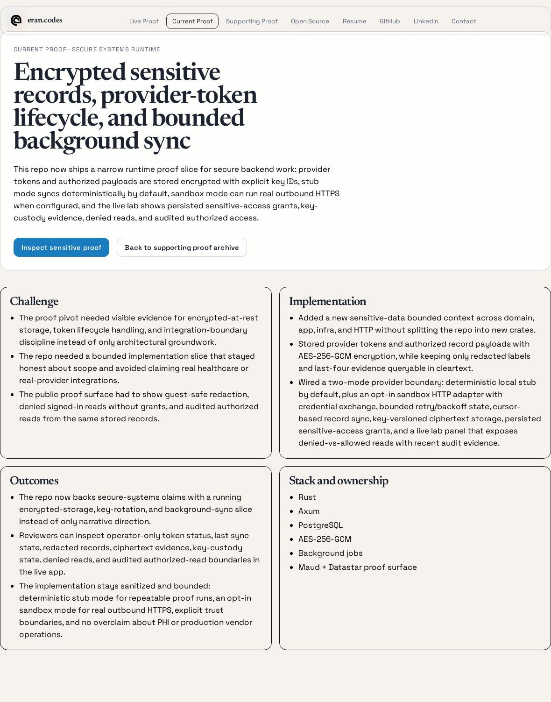
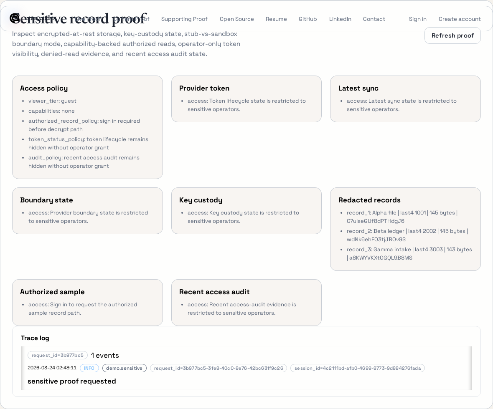

# Healthcare Integration Platform

This is a sanitized overview of an independent Rust project built around healthcare integrations, encrypted PHI handling, and clear service boundaries.

## What the system did

- integrated with the Elation EMR API
- synchronized patient, prescription, and lab-result data
- managed access-token retrieval, refresh, and scoped internal exposure
- separated external integration concerns from internal application and storage layers

## Representative flow

```text
Elation EMR API
  -> sync worker
  -> validation and normalization
  -> encrypted persistence for PHI fields
  -> internal services
     -> redacted read path by default
     -> decrypt-on-read only for authorized surfaces
```

In practice, that meant a background sync job could ingest external records without turning the rest of the application into a broad plaintext access path. Sensitive fields were encrypted before they were stored, and internal consumers only got decrypted values through narrow authorized paths.

## Public demo

The closest public version of this work is the secure-data demo in [`eran.codes`](https://github.com/eboody/eran.codes).



This page shows the focused case study: encrypted records, token refresh, background sync, and clear limits on what the demo does and does not claim.



This panel shows the live runtime view: access rules, redacted records, token details for operators, key state, denied reads, and audit entries.

## Architecture

The project was a multi-crate Rust workspace with dedicated pieces for:
- web serving
- token management
- EMR synchronization
- auth and RPC
- core domain libraries

The important part was not the crate count by itself. It was keeping the boundaries clear so external EMR behavior, internal services, and storage concerns did not collapse into one layer.

## Sensitive data handling

- AES-256-GCM encryption and decryption for PHI fields
- encrypted storage on create and update paths
- controlled decrypt-on-read surfaces instead of broad plaintext access
- Redis-backed caching flows for patient-name lookup data and EMR access tokens

## Operational flows

- scheduled synchronization for patient, prescription, and lab-result ingestion
- token expiration and refresh handling
- cache repopulation and scoped service exposure
- controlled data movement between integration, application, and storage boundaries

## What this was proving

- sensitive data could move through the system without flattening the service boundaries
- token handling stayed separate from the business logic that only needed scoped access
- encrypted-at-rest storage and decrypt-on-read access were built into the system, not left to convention

## Why this is sanitized

This writeup leaves out proprietary schema details, identifiers, and deployment specifics. The goal is to show the system shape and technical decisions that matter for evaluating the work.
